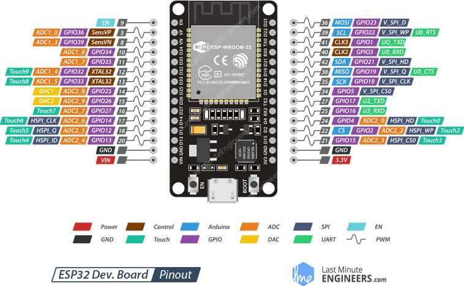

# ESP-Wroom-32

## ESP-WROOM-32 Module

The development board equips the ESP-WROOM-32 module containing **Tensilica Xtensa® Dual-Core 32-bit LX6 microprocessor**. This processor is similar to the ESP8266 but has two CPU cores (can be individually controlled), operates at **80 to 240 MHz** adjustable clock frequency and performs at up to **600 DMIPS** (Dhrystone Million Instructions Per Second).


ESP-WROOM-32 Chip

- Xtensa® Dual-Core 32-bit LX6
- Upto 240MHz Clock Freq.
- 520kB internal SRAM
- 4MB external flash
- 802.11b/g/n Wi-Fi transceiver
- Bluetooth 4.2/BLE

There’s also 
- **448 KB of ROM**.
Read-only memory (ROM), also known as firmware, is an integrated circuit programmed with specific data when it is manufactured. It contains the programming needed to start an electronic device, which is essential for boot-up; it performs major input/output tasks and holds programs or software instructions (eg BIOS).
- **520 KB of SRAM**.
Static Random Access Memory (Static RAM or SRAM) is a type of RAM that holds data in a static form, that is, as long as the memory has power.
- **4MB of Flash memory**.
Flash memory is used for easy and fast information storage in computers, digital cameras and home video game consoles. It is used more like a hard drive than as RAM.

for program and data storage) just enough to cope with the large strings that make up web pages, JSON/XML data, and everything we throw at IoT devices nowadays.

 Static RAM

## Pinout




Taken from this tutorial: [Insight Into ESP32 Features](https://lastminuteengineers.com/esp32-arduino-ide-tutorial/) & Using It With Arduino IDE.

A second useful article is [ESP32: Internal Details and Pinout](<https://www.instructables.com/id/ESP32-Internal-Details-and-Pinout/>).


## Implementation

Vout from microphone/pre-amp to ADC2 ch0 = GPIO4, pin 24.

Green LED 1 on GPIO16, pin 25.
Green LED 2 on GPIO17, pin 27.
Yellow LED 1 on GPIO18, pin 35.
Red LED 1 on GPIO19, pin 38.


## Code

```
from machine import Pin
import time
import random

led1 = 1 #Pin(12, Pin.OUT)
led2 = 2 #Pin(13, Pin.OUT)
led3 = 3 #Pin(14, Pin.OUT)
led4 = 4 #Pin(15, Pin.OUT)

leds = [led1, led2, led3, led4]

while True:
    randomValue = random.randint(0,4)
    print("randomValue " + str(randomValue))
    
    for i in range(0, len(leds)): 
        if randomValue > i:
            print("switching on LED number " + str(i))
            #leds[i].value(1)
        else:
            print("switching off LED number " + str(i))
            #leds[i].value(0)
    time.sleep(1)
```